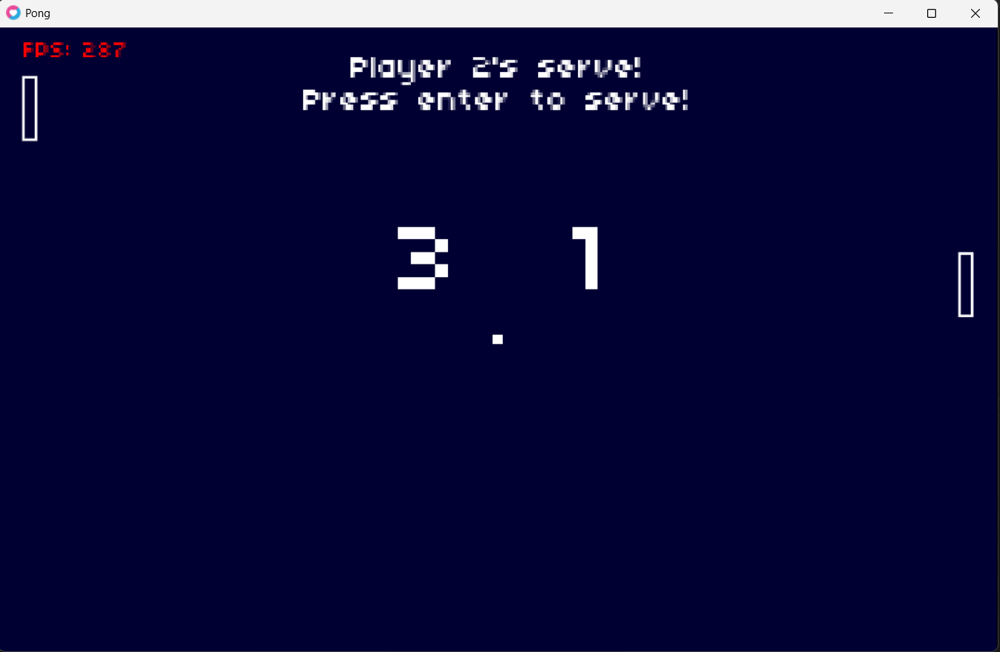
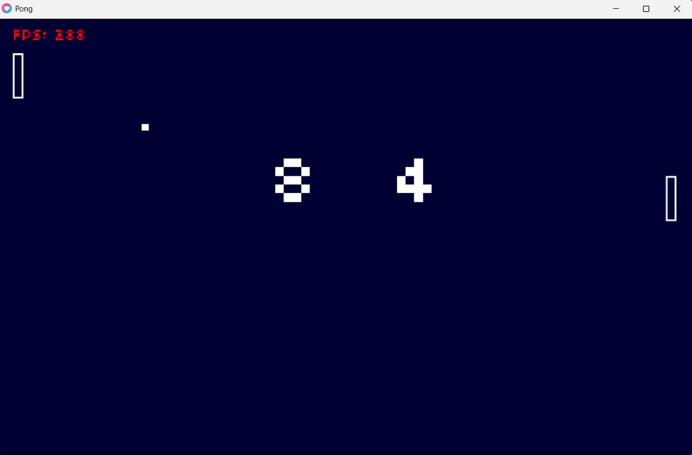
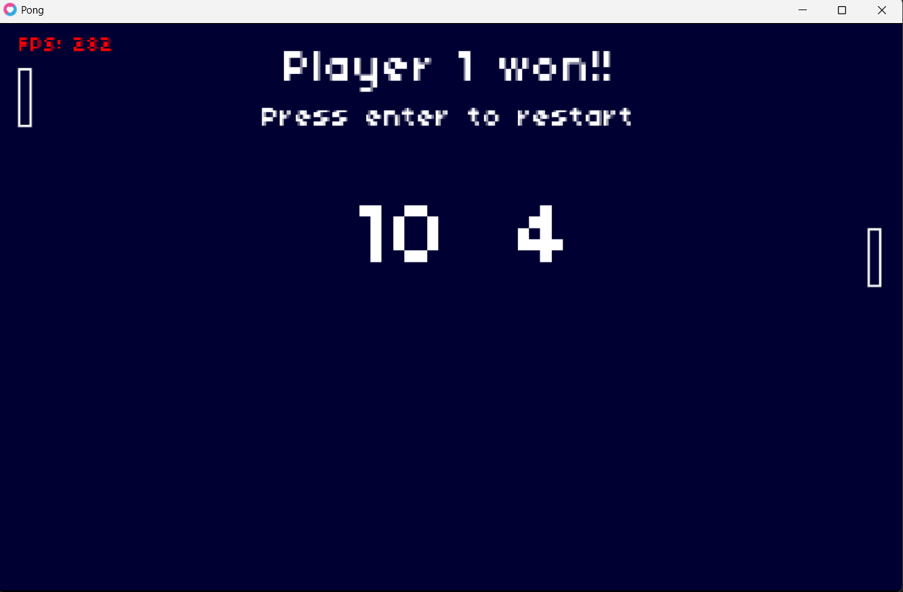

# <samp>🕹️ Pong Game in Love2D</samp>

<samp>A simple yet expandable <strong>2D Pong clone </strong> made with [LÖVE (Love2D)](https://love2d.org/) — ideal for learning game loops, collision detection, and basic game physics.</samp>

---

## <samp> 📸 Screenshots</samp>

  
  
  

---

## <samp>🚀 Features</samp>

- <samp>🟦 Classic Pong gameplay</samp>
- <samp>🎮 Two-player controls</samp>
- <samp>🔄 Ball collision physics with paddles and walls</samp>
- <samp>🧠 Progressive speed increase</samp>
- <samp>💻 Written entirely in Lua with Love2D</samp>

---

## <samp> 🎮 Controls</samp>

| Player | Key        | Action         |
|--------|------------|----------------|
| Player 1 | `W` / `S`    | Move Up / Down |
| Player 2 | `Up` / `Down` | Move Up / Down |
| Game     | `Enter`      | Start / Restart |

---

## <samp>🧰 Requirements</samp>

- [Love2D 11.x](https://love2d.org/)
- A system that supports Lua 5.1+

## <samp> 📄 License </samp>
This project is licensed under the MIT License.
- Copyright (c) 2018 Ulysse Ramage
- Copyright (c) 2010-2013 Matthias Richter

